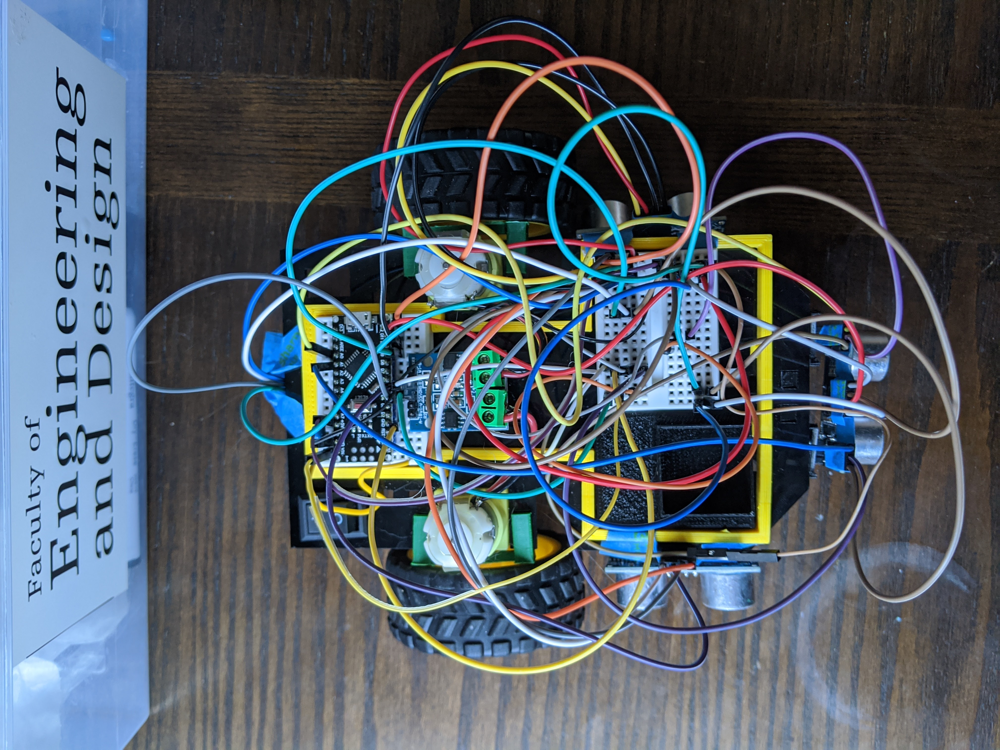

# SYSC4805--Self-Parking
Basic sensors used to create a two wheeled self parking car 

This was our SYSC 4805 project of a self parking modelled car. All information is enclosed in the zip file.

| col 1      | col 2      |
|------------|-------------|
|||
